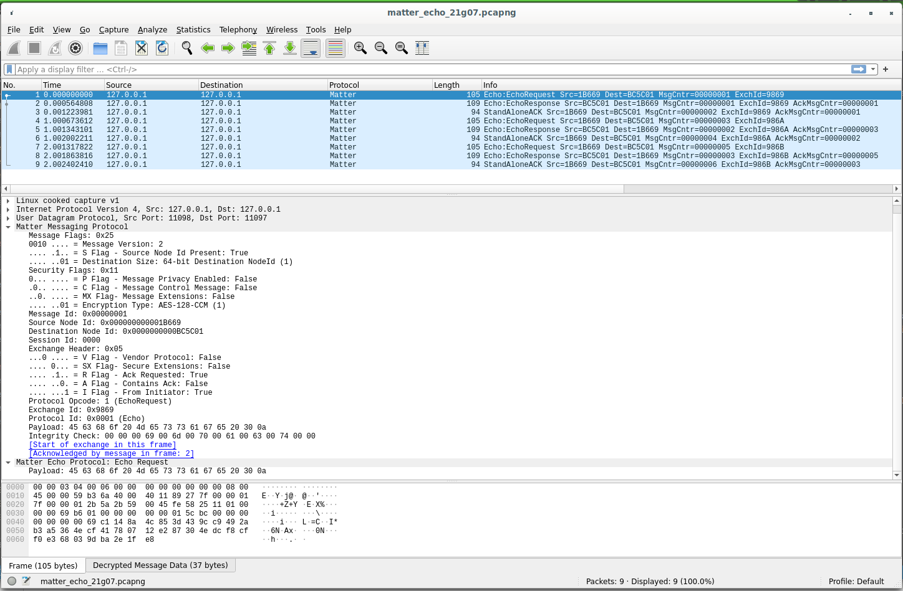

# Overview

The Matter Wireshark dissector is a Wireshark plugin that supports dissecting network packets containing Matter messages.



## Features

The Matter Wireshark dissector provides a variety of features for inspecting the contents of a Matter message, including:

* Decoding of the secure Matter message format
  - [X] Message header: all mandatory and optional fields such as flags and source and destination node ids.
  - [X] Protocol Header: Protocol Id and Opcode, MRP fields, Exchange headers, etc.
  - [X] Decryption and authentication: Nonce generation and AES-CCM decryption according to specification.
* Tracking Matter exchanges
  - [X] Includes identifying the first message in an exchange and filtering messages by exchanges.
  - [X] Identifying Matter Message Reliability Protocol (MRP) acknowledgements and message retransmissions.
* Providing text translations for well-known Matter protocols, protocol opcodes and status codes.
* Tracking Interaction Model (IM) subscriptions and subsequent messages related to a subscription.

The Matter Wireshark dissector recognizes protocol opcodes for many of the currently-defined Matter protocols.  Additionally, the dissector supports deep inspection of message payloads for the following protocols:

* Matter Secure Channel Protocol (aka Common Profile)
  - [X] MRP Ack and StatusReport messages
  - [ ] Matter MessageCounterSync and KeyError messages
  - [X] Matter CASE / PASE
    * All session establishment messages
    * Limited support for displaying Matter certificates
- [X] Matter Echo Profile (all messages)
- [ ] Interaction Model Protocol (all IM messages)
    - [X] Command Request / Response
    - [ ] Attribute Read
    - [ ] Attribute Write
    - [ ] Subscribe
    - [ ] Events
- Cluster Support
    - [ ] User Directed Commissioning [UDC]
    - [ ] On/Off
    ...
### Security Features

The Matter Wireshark dissector contains a number of features that make debugging secure Matter interactions easier.  At the most basic level, the dissector supports automatic decryption of Matter messages using encryption keys that are manually entered by the user. This supports scenarios where one or both ends of a communication intentionally leak the keys for debugging purposes (e.g. via log messages). Encryption keys can be entered via the Matter preferences dialog, and persist across Wireshark sessions.
In addition to manually entered keys, the dissector also has the ability to detect the use of well-known Matter CASE keys, allowing the entirety of a Matter CASE session to be decrypted automatically. This feature relies on one or both parties using a well-known ECDH key during CASE session establishment. Use of well-known ECDH keys can be enabled in Matter core code via the use of special build and runtime flags (see MATTER_CONFIG_SECURITY_TEST_MODE and MatterSecurityManager::CASEUseKnownECDHKey).

## Limitations
The Matter Wireshark dissector is currently a work in progress in experimental status.
As such, users should be aware of certain limitations:

* __TCP and UDP only__: The dissector is only capable of decoding Matter messages that are conveyed via TCP or UDP (IPv6 and IPv4).  Matter messages communicated over BLE are not supported.
* __Linux x86_64 only__: At the present time the Matter Wireshark dissector has been tested on Linux x86_64 only.

Users should also be aware that the Matter dissector may have bugs that may cause Wireshark to crash, especially when encountering combinations of Matter protocols and clusters with which the dissector has not yet been tested.  So if you are trying to capture a network protocol error that only occurs once every month, you probably should disable the Matter dissector.


## Installation
The current version of the Matter Wireshark plugin only runs on linux and requires Wireshark 3.6 or later.  This version is offered as a standard package on Ubuntu 18 and gLinux.  For older versions of Ubuntu, please see Upgrading Wireshark on Ubuntu below.

Installing the Wireshark plugin is as simple as copying the shared library file into your local plugins directory:

    mkdir -p ${HOME}/.local/lib/wireshark/plugins/3.6/epan
    cp matter-dissector.so ${HOME}.local/lib/wireshark/plugins/3.6/epan
    chmod 700 ${HOME}/.local/lib/wireshark/plugins/3.6/epan/matter-dissector.so

## Upgrading Wireshark on Ubuntu
The Wireshark team maintains a PPA for Wireshark releases that have been back-ported to older Ubuntu distros: https://launchpad.net/~wireshark-dev/+archive/ubuntu/stable.

Users can run the following commands to install/upgrade their Wireshark installation to the latest version:

    sudo add-apt-repository ppa:wireshark-dev/stable
    sudo apt-get update
    sudo apt-get install wireshark


## Bulding the Matter Wireshark Plugin
### Install dependencies 

Install dependencies on Linux:

    sudo apt-get build-dep wireshark

Install dependencies on Mac:

     *** not tested on Mac yet ***

### Build Wireshark includes

Building the Matter Wireshark plugin requires access to a Wireshark source tree that has been built, or at least prepared for building.  This can be accompished as follows:

    sudo apt-get install -y build-essential git cmake flex bison qttools5-dev qttools5-dev-tools libqt5svg5-dev qtmultimedia5-dev libpcap-dev libc-ares-dev libgcrypt20-dev libglib2.0-dev libpcre2-dev libnghttp2-dev libqt5core5a

    git clone https://gitlab.com/wireshark/wireshark.git
    cd wireshark
    git checkout release-3.6
    mkdir build
    cd build
    cmake ..

    # Optional
    make
    sudo make install
    sudo ldconfig

    # Or with Ninja
    cmake -GNinja ..
    ninja
    sudo ninja install

### Build Matter dissector

Once the Wireshark source is prepared, one can clone and build the Matter Wireshark plugin as follows:

    git clone git@github.com:project-chip/matter-dissector.git
    cd matter-dissector
    WIRESHARK_SRC_DIR=<path to wireshark source directory> make

Note that WIRESHARK_SRC_DIR defaults to "../wireshark".

## Make command

The Makefile includes various commands to simplify common operations.

### Build matter-dissector

This will build the dissector plugin.

```
make
```

This will clean out build artifacts.

```
make clean
```

### Install matter-dissector

This will build the dissector and copy it to the appropriate Wireshark plugin directory for the local user.

```
make install
```

### Test matter-dissector

This will build and install the dissector, and then start Wireshark with an example capture file of a simple Matter Echo protocol exchange.

#### Load echo capture

This will run wireshark and load a test capture of echo protocol request and response.

```
make test
```

#### Load PASE capture

This will run wireshark and load a test capture of PASE pairing.

```
make testpase
```

### Debug matter-dissector

This will run the test above via gdb, allowing for breakpoints and single-step debugging of the dissector running within Wireshark while parsing the sample Echo protocol exchange.

```
make debug
(gdb) b DissectMatter
Function "DissectMatter" not defined.
Make breakpoint pending on future shared library load? (y or [n]) y
Breakpoint 1 (DissectMatter) pending.
(gdb) run
```

### Check matter-dissector

This will run the unit tests, including verification of the AES-CCM decryption and parsing of fixed sample packets.

NOTE: the number of unit tests are currently quite limited.

```
make check
```

## Tips for Use

### Setup

#### Encryption Keys

In order to use the sniffer, one needs to install the encryption keys Matter nodes use to communicate.
#### Manually adding Encryption Keys

1) Select Edit menu -> Preferences ...

2) In tab to left, select Protocols -> Matter

3) In dialog to right, select Matter Encryption Keys [Edit ...]

4) Select [+]

5) Enter a 128-bit key in hex (32 characters long) and hit return.

#### Stock developer Encryption Keys

Many of the Matter SDK examples, included the test traces included in matter-dissector, use the following developer keys as generated by `SecureSession::InitFromSecret`:

```
CryptoContext::InitFromSecret(
    Secret = "Test secret for key derivation."
    Size = 32
    Salt = null
)

Initiator-to-Responder Test key: 5EDED244E5532B3CDC23409DBAD052D2
Responder-to-Initiator Test key: A9E011B1737C6D4B70E4C0A2FE660476
```

#### Working with developer build

Both CASE and PASE sessions negotiate those keys anew every time a session is established.
Because these keys are somewhat ephemeral and generally not accessable, extending the sniffer tool to dissect more clusters and protocols within the Matter specification can be a challenge.

There are few ways around this limitation in order to unblock use cases where the sniffer can add value.  The simplest method, which only applies to a pure development environment, is to configure the SDK to resolve all keys negotiated by CASE and PASE to a fixed, known key.  To do this, use the following configuration flag:

```
#define CHIP_CONFIG_SECURITY_TEST_MODE 1
```
WARNING: Firmware built with the above flag will use the "Stock developer Encryption Keys" for all communication, subverting Matter security, and MUST NOT be used in production builds.
### Usage

#### Filtering Matter messages

To filter a trace to only show Matter messages, enter the following in the green filter entry box: `matter`.

NOTE: the current filter assumes port 5540.  If neither node is using port 5540, the messages will not be seen by the filter.

To show all Matter messages and Matter-related mdns, use the following filter:

```
matter || dns.qry.name contains matter || dns.resp.name contains matter
```

Outdated filter:

```
matter || dns.ptr.domain_name==_matterc._udp.local || dns.ptr.domain_name==_matter._tcp.local
```

#### Viewing a Single Matter Exchange
1) Select a packet containing a message that is part of the desired exchange.

2) Select the Analyze menu -> Conversation Filter -> Matter Exchange

#### Viewing all messages in a IM Subscription
1) Select a packet containing a message that is part of the desired subscription.  This can be the SubscribeRequest/Response, a NotificationRequest or any one of the StatusReports or StandAloneACKs associated with the subscription.

2) Select the Analyze menu -> Conversation Filter -> Matter IM Subscription

#### Viewing a Packet from a Text Log
If you have a hex dump of an IP packet containing a Matter message you can view this in Wireshark using its Import from Hex Dump... feature.  

1) Create a text file containing the hex dump.  The format should look roughly like this:

```
    0000: 60 00 00 00 00 1e 11 fd fd f8 a1 1b c2 bf 00 06 `...............
    0010: 1a b4 30 00 01 40 95 18 fd f8 a1 1b c2 bf 00 05 ..0..@..........
    0020: 1a b4 30 02 00 00 00 13 2b 57 2b 57 00 1e 9f a7 ..0.....+W+W....
    0030: 00 20 76 78 18 cd 17 10 e7 ae 0d 00 00 00 17 6b . vx...........k
    0040: ca 42 9d 00 00 00
```

Each line must begin with an byte offset in hex, followed by the bytes of the packet, also in hex.  Note that the colon is not required, nor is the ASCII representation at the end of the line.

The file can contain multiple packets separated by blank lines.

2) Import the file into Wireshark by selecting File -> Import from Hex Dump...
3) Enter the name of the text file and choose Encapsulation Type: Raw IP.

### Permissions

To solve the issue of live capture with the plugin ("you don't have permission to capture on that device"):

```
# Add your username to the wireshark group.
sudo groupadd wireshark

# Change group ownership of dumpcap to wireshark group.
sudo usermod -a -G wireshark $USER

# Set file permissions of dumpcap to 754 (rwx for user, r-x for group).
sudo chgrp wireshark /usr/local/bin/dumpcap

# Enable file capabilities for dumpcap.
sudo chmod 754 /usr/local/bin/dumpcap
sudo setcap 'CAP_NET_RAW+eip CAP_NET_ADMIN+eip' /usr/local/bin/dumpcap

# Enable packet capture for non-root users (answer Yes to prompt).
sudo dpkg-reconfigure wireshark-common

# Activate the new group so reboot is not required for interfaces to show.
newgrp wireshark
```

#### Thread Network considerations

When sniffing a Thread Network (IEEE 802.15.4), there are additional preferences that need to be set to decrypt the network layer and assemble 6LoWPAN fragments into IPv6 before the Matter dissector can do its work.

See this [tutorial for how to setup Wireshark](https://wiki.makerdiary.com/grove-mesh-kit/openthread-mesh/thread-network-sniffer/#wireshark-configuration-protocols) to decrypt traffic on a test Thread Network.
